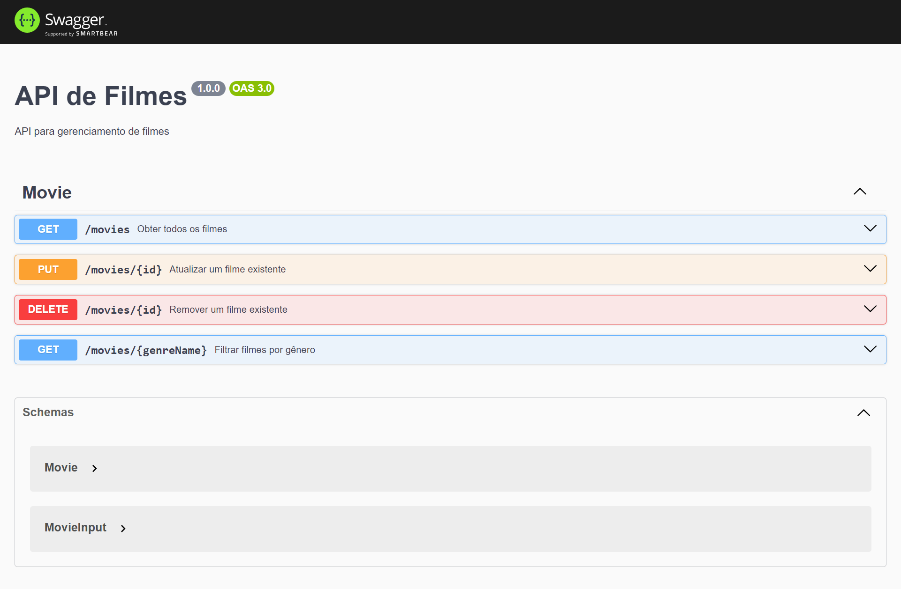

# 🚀 MovieFlix API



> API RESTful para gerenciamento de um catálogo de filmes, construída com Node.js, Express, TypeScript e Prisma para garantir performance e segurança de tipos.

### 🔗 Documentação Interativa (Swagger)

A documentação completa dos endpoints foi criada com Swagger. Para testar e interagir com a API, inicie o projeto localmente e acesse:
**[http://localhost:3000/docs](http://localhost:3000/docs)**

---

### ✨ Funcionalidades Principais

- **Operações CRUD Completas:** Endpoints robustos para Criar, Ler, Atualizar e Deletar filmes no catálogo.
- **Validação de Títulos Duplicados:** Lógica de negócio que impede o cadastro de filmes com o mesmo título, utilizando uma busca *case-insensitive* para maior precisão.
- **Filtro Avançado:** Endpoint específico para consultar e listar filmes por gênero.
- **Segurança de Tipos (Type-Safety):** O uso de TypeScript em conjunto com o Prisma garante que os dados que trafegam pela API, desde o banco de dados até a resposta, sejam consistentes e previsíveis.
- **Documentação Automatizada:** Todos os endpoints são documentados e testáveis diretamente pelo navegador através da interface do Swagger.

---

### 🛠️ Stack de Tecnologias

- **Node.js** e **Express.js** como base para a construção do servidor e das rotas da API.
- **TypeScript** para adicionar tipagem estática, aumentando a robustez e a manutenibilidade do código.
- **Prisma** como ORM para uma comunicação moderna e segura com o banco de dados.
- **Swagger** para documentação e testes interativos da API.
- **ESLint** e **Prettier** para garantir a qualidade e a padronização do código.

---

### 🔧 Como Rodar o Projeto

```bash
# 1. Clone o repositório
git clone https://github.com/alanborgesdev/movieflix-api.git

# 2. Navegue até o diretório
cd movieflix-api

# 3. Instale as dependências com NPM
npm install

# 4. Configure o banco de dados
#    - Renomeie o arquivo `.env.example` para `.env`
#    - Adicione a sua string de conexão do banco de dados na variável DATABASE_URL
#    - Rode as migrações do Prisma
npx prisma migrate dev

# 5. Inicie a aplicação em modo de desenvolvimento
npm run dev

# 6. A API estará rodando em http://localhost:3000
```
---

### 👤 Autor  

Este projeto foi desenvolvido por **[Alan Borges](https://github.com/alanborgesdev)**

---

### 📝 Licença

O código-fonte deste projeto está licenciado sob a [Licença MIT](LICENSE).